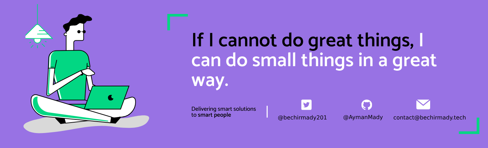

<h1 align="center">Hello I'm Bechir Mady</h1>

  

  

  

## 👨🏻‍💻 About Me:

- 🙋‍♂️ All about me is at **[My Website](http://bechirmady.tech/)**

- 🔭 I’m currently working on `Something Intresting`.

- 🌱 I’m currently learning `flutter`

- 👯 I’m looking to collaborate for `Dev Projects`

- 🤔 I’m looking for help with `Competitive Programming`

- 💬 Ask me about anything, Except Maths :sweat_smile:

- 👨‍💻 Life Hack: Learn new tech :fire: and share what you have learned :tada:

## 🔧 Technologies and Tools I use:

### 🌐 Web Development

  
  
  
  
  

### 📱 Mobile Development

  

### 📊 Data Analytics

  
  
  
  

### 🗄️ Database Management

  
  
  
  

### 🤖 Automation Tools

  

## ❤️ Let's get connected:

  

## 🤝 Support Me:

## 📊 My GitHub Data:

  
  

